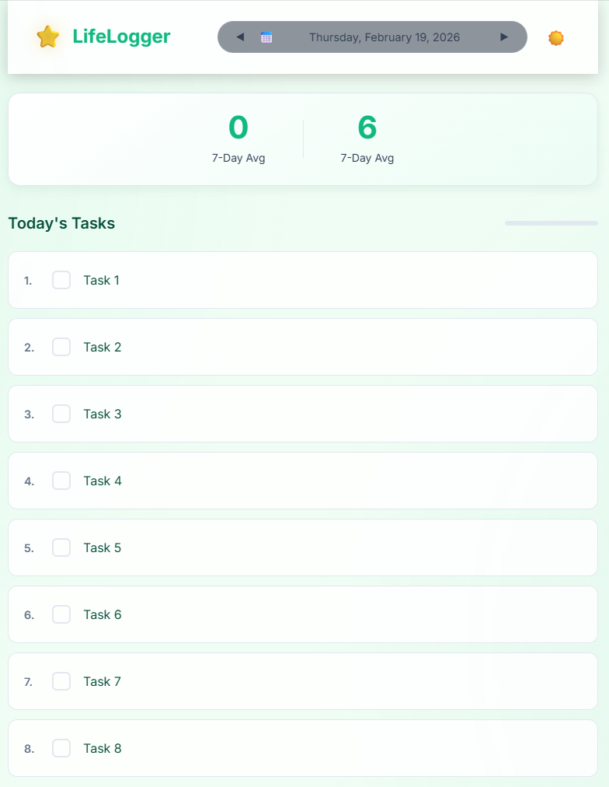
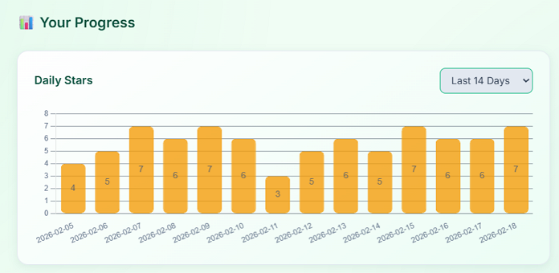

# LifeLogger 🌟

**LifeLogger** is a daily achievement tracker designed to help you build habits and track your productivity. Log your daily tasks, earn stars for completion, and visualize your progress over time with beautiful charts.



## Features

- **Daily Task Tracking**: Create and manage your recurring daily tasks.
- **Star System**: Earn a star ⭐ for every task you complete each day.
- **Progress Visualization**: View your performance with Daily Star charts and Weekly Recaps.
  
- **Persistent History**: Your data is stored securely in the cloud, so you never lose your streak.
- **Responsive Design**: Works great on desktop and mobile.
- **Dark Mode**: Sleek UI with day/night toggle.

## Tech Stack

- **Frontend**: HTML5, CSS3, JavaScript (Vanilla), Chart.js
- **Backend**: Python (Flask)
- **Database**: MySQL (Aiven Cloud)
- **Deployment**: Vercel

## Getting Started

### Prerequisites

- Python 3.10+
- MySQL Database (Local or Cloud)

### Installation

1.  **Clone the repository**

    ```bash
    git clone https://github.com/maverick001/LifeLogger.git
    cd LifeLogger
    ```

2.  **Install dependencies**

    ```bash
    pip install -r requirements.txt
    ```

3.  **Configure Environment**
    Copy `.env.template` to `.env` and fill in your database credentials:

    ```bash
    cp .env.template .env
    # Edit .env with your DB details
    ```

4.  **Initialize Database**
    Run the initialization script in your MySQL database:

    ```bash
    mysql -u root -p < init_db.sql
    ```

5.  **Run the App**
    ```bash
    python app.py
    ```
    Open [http://localhost:5004](http://localhost:5004) in your browser.

## Deployment

This app is configured for easy deployment on **Vercel**.

1.  Push to GitHub.
2.  Import project in Vercel.
3.  Add Environment Variables from your `.env` file to Vercel.
4.  Deploy!

## License

This project is open source and available under the [MIT License](LICENSE).
